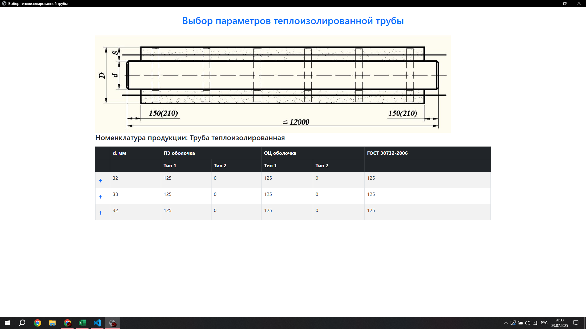

# 1. Программа для расчета себестоимости и расходов материалов на производство ППУ-изолированной трубы
Данная программа расчитывает количество материалов необходимого для производства теплоизолированной трубы в зависимости от диаметра и толщины трубы и теплоизоляционного слоя, а так же себестоимость производства и установки трубы

# 2. Интерфейс программы

# 3. Стэк
**Frontend**: HTML/CSS/JavaScript, Bootstrap
**Backend**: Eel, Python

# 4. Установка и запуск
# Запуск виртуального окружения

.\env\Scripts\activate

# Установка зависимостей

pip install requirements.txt

# Запуск приложения

python main.py

### **5. Как пользоваться**  
Краткое руководство по основным функциям.  

Пример:  
1. Откройте приложение.
2. Выберите параметры трубы.
3. Нажмите "Рассчитать".
4. Просмотрите результаты в разделе "Экономика".